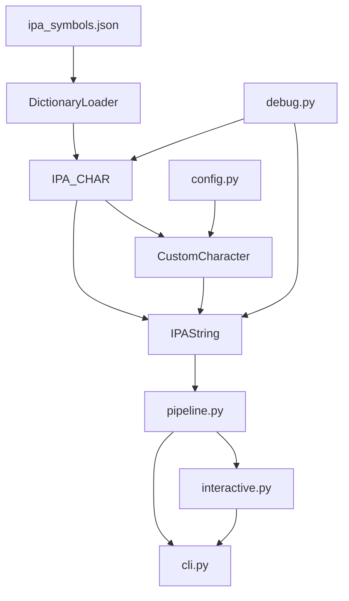

# IPA Parser


UTF-8 Unicode IPA parser and analysis toolkit.

Created for PRAAT TextGrid rhythm typology research at the SPArK lab.
Parses IPA strings phonetically (not character-wise) using grapheme-cluster-aware
maximal munch segmentation backed by a comprehensive JSON dictionary of official
IPA symbols defined in `src/ipa/data/ipa_symbols.json`.

## Table of Contents

- [Prerequisites](#prerequisites)
- [Installation](#installation)
- [CLI Usage](#cli-usage)
  - [Interactive Mode](#interactive-mode)
  - [Batch Mode](#batch-mode)
  - [CLI Flags](#cli-flags)
  - [Interactive Menu](#interactive-menu)
- [Features](#features)
- [Architecture](#architecture)
  - [Layer Descriptions](#layer-descriptions)
  - [Pipeline Data Flow](#pipeline-data-flow)
- [Library Usage](#library-usage)
  - [IPAString](#ipastring)
  - [IPA_CHAR](#ipa_char)
  - [CustomCharacter](#customcharacter)
  - [Common Affricates and Diphthongs](#common-affricates-and-diphthongs)
  - [ValidationError](#validationerror)
- [Language Configuration (TOML)](#language-configuration-toml)
  - [Config File Format](#config-file-format)
  - [Loading a Config](#loading-a-config)
  - [Config Write API](#config-write-api)
- [Data Source: ipa_symbols.json](#data-source-ipa_symbolsjson)
- [Development](#development)
- [License](#license)

## Prerequisites

- Python >= 3.11
- [pandas](https://pandas.pydata.org/) >= 2.2.0
- [openpyxl](https://openpyxl.readthedocs.io/) >= 3.1.2

Runtime dependencies are declared in `pyproject.toml` and installed automatically
when you install the package.

## Installation

```bash
python -m venv .venv
.venv/bin/python -m pip install -e .
```

For development (includes pytest, pytest-cov, ruff, mypy):

```bash
.venv/bin/python -m pip install -e ".[dev]"
```

## CLI Usage

### Interactive mode

The simplest way to start is with no arguments at all. The CLI presents
numbered file selectors for both the input spreadsheet and the language config:

```bash
ipa-parser
```

```
Available input spreadsheet files:
  1) NorthernTepehuan.xlsx
  2) NorthwestSahaptin.xlsx
  3) Oriental_Hebrew.xlsx

Select input spreadsheet (number, or 'q' to quit): 2

Available language config files:
  1) Italian.toml
  2) Northern_Tepehuan.toml
  3) Northwest_Sahaptin.toml

Select language config (number, or 'q' to quit): 3
```

You can also pass paths directly to skip the file selector:

```bash
ipa-parser data/unprocessed/NorthwestSahaptin.xlsx \
  --config data/language_settings/Northwest_Sahaptin.toml
```

If `--config` is omitted, the file selector is shown for just the config.
If no TOML files exist, the CLI falls back to `geminate=True` and registers
`OP` and `SP` as default pause markers.

### Batch mode

Add `--run` to skip the interactive menu and run the pipeline directly.
Batch mode requires an explicit input path:

```bash
ipa-parser data/unprocessed/NorthwestSahaptin.xlsx \
  --config data/language_settings/Northwest_Sahaptin.toml --run
# -> data/processed/2026-02-23_NorthwestSahaptin_auto.csv
# -> data/processed/2026-02-23_NorthwestSahaptin_auto.xlsx
```

Output files are auto-named from the input filename with a `YYYY-MM-DD` prefix
and `_auto` suffix, written to `data/processed/` by default.

### CLI flags

| Flag | Default | Description |
|---|---|---|
| `--config PATH` | interactive file selector | Path to TOML language config |
| `--geminate` / `--no-geminate` | from config | Override geminate collapsing |
| `--run` | off | Skip interactive menu, run pipeline directly |
| `--format FORMAT` | `both` | Output format: `csv`, `xlsx`, or `both` |
| `--output-csv PATH` | auto-generated | Override CSV output path |
| `--output-xlsx PATH` | auto-generated | Override XLSX output path |

### Interactive menu

The interactive CLI presents ten options:

| Option | Description |
|---|---|
| 1 | **Show word list** -- tabular display of all words with syllable count, phonological length, and stress pattern |
| 2 | **Inspect word** -- detailed segment-level breakdown: processed form, segments, types, CV types, syllables, length, stress, coda, geminate status |
| 3 | **Show unique graphemes** -- frequency-ranked list of every segment token in the corpus |
| 4 | **Show non-phoneme marks** -- weight-0 symbols (diacritics, pauses, tones) grouped by category |
| 5 | **Show unrecognized symbols** -- segments absent from both the IPA table and registered custom characters |
| 6 | **Show custom characters** -- currently registered `CustomCharacter` entries with categories and ranks |
| 7 | **Add custom character** -- register a new sequence and optionally persist it to the TOML config |
| 8 | **Remove custom character** -- remove a sequence from both the in-memory registry and the TOML config |
| 9 | **Run pipeline and export** -- execute the full pipeline and write CSV/XLSX output |
| 10 | **Quit** |

After adding or removing a custom character (options 7 and 8), the CLI
automatically re-scans for unrecognized symbols and prints any remaining.

## Features

- Parse IPA strings into individual phonemes via grapheme-cluster-aware maximal munch segmentation
- Handle tie bars (U+0361, U+035C) and Unicode combining marks as part of their base character
- Identify and categorize consonants, vowels, diacritics, suprasegmentals, tones, and accent marks
- Support custom categories: AFFRICATE, DIPHTHONG, PAUSE (via `CustomCharacter`)
- Compute phonological length (weight-based: consonants/vowels = 1, diacritics/marks = 0)
- Analyze syllable structure, stress patterns, and coda complexity
- Calculate word/syllable/sentence durations and inter-stress intervals (ISI)
- Detect phoneme alignment mismatches between input words and parsed segments
- Bulk-register common IPA affricates and diphthongs with one method call
- Support language-specific rules via TOML configs and `CustomCharacter`

## Architecture

The library is organized as stacked layers, each building on the one below.



### Layer descriptions

| Layer | Module | Responsibility |
|---|---|---|
| Data | `dict_loader.py` | Loads `ipa_symbols.json`; normalizes entries into a name-keyed lookup map with hex codes stored per entry |
| Character | `ipa_char.py` | `IPA_CHAR` class methods: `category`, `name`, `code`, `rank`, `is_valid_char` |
| Custom | `ipa_char.py` | `CustomCharacter` stores multi-character sequences (affricates, diphthongs, pauses) with category and rank; includes bulk registration for common affricates/diphthongs |
| Config | `config.py` | Loads, saves, appends, and removes entries in TOML language config files |
| String | `ipa_string.py` | `IPAString` tokenizes with grapheme-cluster-aware maximal munch, validates segments (including tie-bar detection), computes length, stress, syllables, and coda |
| Pipeline | `pipeline.py` | Orchestrates Excel ingestion through per-phoneme metrics to ISI computation and CSV/XLSX export |
| Interactive | `interactive.py` | 10-option menu loop for word inspection, grapheme exploration, custom character management, and pipeline export |
| Debug | `debug.py` | `ValidationError` with 8 error type codes and formatted diagnostic messages |
| CLI | `cli.py` | Argument parsing, file selection prompts, batch/interactive mode dispatch |

### Pipeline data flow

```mermaid
flowchart LR
    IN[Excel input] --> LOAD[load_excel]
    LOAD --> PRE[Preprocessing\ninsert_sp / assign_pauses]
    PRE --> WORD[Word metrics\nlength, duration]
    WORD --> SYLL[Syllable metrics\nlength, duration, coda, stress]
    SYLL --> PHON[Phoneme metrics\nsegment type columns]
    PHON --> SENT[Sentence metrics\nduration, length]
    SENT --> ISI[ISI metrics\ninter-stress intervals]
    ISI --> FIN[Finalization\npause fill, column select]
    FIN --> OUT[CSV / XLSX output]
```



The pipeline entry point is `build_final_dataframe` in `src/ipa/pipeline.py`.

## Library Usage

### IPAString

```python
from ipa import IPAString

word = IPAString("bə.ˈnæ.nə")
```

**Segments and types:**

```python
word.segments
# ['b', 'ə', '.', 'ˈ', 'n', 'æ', '.', 'n', 'ə']

word.segment_type
# ['CONSONANT', 'VOWEL', 'SUPRASEGMENTAL', 'SUPRASEGMENTAL',
#  'CONSONANT', 'VOWEL', 'SUPRASEGMENTAL', 'CONSONANT', 'VOWEL']

word.segment_count
# {'V': 3, 'C': 3}
# Note: AFFRICATE counts as C, DIPHTHONG counts as V
```

**Phonological length:**

```python
word.total_length()   # 6 (consonants + vowels only; diacritics/marks = 0)
```

**Stress:**

```python
word.stress()         # "STRESSED"  (contains ˈ)

# Secondary stress
IPAString("ˌbæ.nə").stress()  # "STRESSED_2"
```

**Syllables and coda:**

```python
word.syllables        # ['bə', 'ˈnæ', 'nə']
word.coda             # 0 (no consonants after last vowel in final syllable)

# Word with a coda
IPAString("kæt").coda  # 1
```

**Geminate handling:**

```python
# With geminate collapsing (default): "pp" -> "p"
IPAString("ˈhæp.pi", geminate=True).total_length()   # 4

# Without geminate collapsing: "pp" stays "pp"
IPAString("ˈhæp.pi", geminate=False).total_length()   # 5
```

**Processed string and char-only:**

```python
word = IPAString("ˈnæ.nə")

# process_string() returns the geminate-processed form
word.process_string()   # "ˈnæ.nə" (no geminates here, so unchanged)

# char_only() strips diacritics, suprasegmentals, tones, and accent marks
word.char_only()        # "nænə"
```

**Unicode representation:**

```python
word = IPAString("pa")
word.unicode_string     # "\u0070\u0061"
```

### IPA_CHAR

```python
from ipa import IPA_CHAR

IPA_CHAR.category("p")       # "CONSONANT"
IPA_CHAR.name("p")           # "VOICELESS BILABIAL PLOSIVE"
IPA_CHAR.rank("p")           # 1
IPA_CHAR.rank("ˈ")           # 0
IPA_CHAR.code("p")           # "0070"
IPA_CHAR.is_valid_char("p")  # True
IPA_CHAR.is_valid_char("@")  # False
```

### CustomCharacter

`CustomCharacter` extends the base IPA symbol set with multi-character
sequences that take priority during maximal munch segmentation.

```python
from ipa import CustomCharacter

# Register a tie-bar affricate
CustomCharacter.add_char("t͡s", "AFFRICATE", rank=1)

# Register a diphthong
CustomCharacter.add_char("ai", "DIPHTHONG", rank=1)

# Register a pause marker
CustomCharacter.add_char("OP", "PAUSE", rank=0)

# Query the registry
CustomCharacter.is_valid_char("t͡s")  # True
CustomCharacter.get_char("t͡s")
# {'category': 'AFFRICATE', 'rank': 1}

# Remove a custom character
CustomCharacter.remove_char("OP")

# Clear all registered custom characters
CustomCharacter.clear_all_chars()
```

**Valid categories:**

```python
CustomCharacter.VALID_CATEGORIES
# {'CONSONANT', 'VOWEL', 'DIPHTHONG', 'AFFRICATE', 'PAUSE',
#  'DIACRITIC', 'SUPRASEGMENTAL', 'TONE', 'ACCENT_MARK'}
```

### Common affricates and diphthongs

The library ships with dictionaries of standard IPA affricates and diphthongs
and convenience methods to register them all at once:

```python
from ipa import CustomCharacter, COMMON_AFFRICATES, COMMON_DIPHTHONGS

# View the built-in affricates
COMMON_AFFRICATES
# {'t͡s': 'voiceless alveolar affricate',
#  'd͡z': 'voiced alveolar affricate',
#  't͡ʃ': 'voiceless postalveolar affricate',
#  'd͡ʒ': 'voiced postalveolar affricate',
#  't͡ɕ': 'voiceless alveolo-palatal affricate',
#  'd͡ʑ': 'voiced alveolo-palatal affricate',
#  't͡θ': 'voiceless dental affricate',
#  't͡ɬ': 'voiceless alveolar lateral affricate'}

# Register all common affricates as AFFRICATE category
CustomCharacter.register_common_affricates()

# Register all common diphthongs as DIPHTHONG category
CustomCharacter.register_common_diphthongs()
```

### ValidationError

The library uses a single exception class with machine-readable error type
codes. All validation failures raise `ValidationError`.

```python
from ipa import ValidationError, IPAString

try:
    IPAString("@@@")
except ValidationError as exc:
    print(exc.error_type)  # "INVALID_SEGMENT"
    print(exc)             # formatted diagnostic message
```

**Error type codes:**

| Error Type | Required kwargs | Raised when |
|---|---|---|
| `FILE_NOT_FOUND` | `file_path` | Data file missing |
| `INVALID_JSON` | `file_path` | Data file is not valid JSON |
| `INVALID_SCHEMA` | `file_path` | Data file has wrong structure |
| `EMPTY_INPUT_CHARACTER` | (none) | Empty or whitespace-only input to `IPA_CHAR` |
| `SYMBOL_NOT_FOUND` | `char` | Character not in the IPA symbol table |
| `INVALID_SEGMENT` | `segment`, `string` | One or more segments cannot be resolved |
| `UNREGISTERED_TIE_BAR` | `segment` | Tie-bar sequence not registered as a custom character |
| `STRING OR LIST MISMATCH` | (none) | Lists or strings are not the same length |

The `UNREGISTERED_TIE_BAR` error is particularly helpful -- it fires when
an affricate or diphthong with a tie bar is encountered but hasn't been
registered, and the error message includes the exact `CustomCharacter.add_char`
call and TOML config snippet needed to fix it:

```python
try:
    IPAString("t͡sa")
except ValidationError as exc:
    print(exc)
    # ValidationError [UNREGISTERED_TIE_BAR]: Unregistered tie-bar sequence: 't͡s'
    #     Register it with: CustomCharacter.add_char("t͡s", "AFFRICATE", rank=1)
    #     Or add to your language config TOML:
    #         [[custom_chars]]
    #         sequence = "t͡s"
    #         category = "AFFRICATE"
    #         rank = 1
```

## Language Configuration (TOML)

Language-specific behaviour is controlled by a TOML file placed in
`data/language_settings/`. Pass the file to the CLI with `--config`, or load it
in Python via `load_language_config`.

See [`data/language_settings/README.md`](data/language_settings/README.md) for
the full config format reference, valid category values, and rank semantics.

### Config file format

```toml
# Collapse consecutive identical consonants (geminate reduction).
# Set to false if geminates are phonologically contrastive.
geminate = true

# Each [[custom_chars]] block defines one multi-character sequence.
[[custom_chars]]
sequence = "t͡s"    # The exact Unicode string to match during segmentation
category = "CONSONANT"
rank = 1            # 1 for consonants/vowels, 0 for pauses/marks

[[custom_chars]]
sequence = "OP"
category = "PAUSE"
rank = 0
```

### Loading a config

Via CLI:

```bash
ipa-parser data/unprocessed/input.xlsx --config data/language_settings/my_language.toml
```

Via Python:

```python
from ipa import load_language_config, CustomCharacter

geminate, custom_chars = load_language_config("data/language_settings/my_language.toml")
# geminate: bool
# custom_chars: list[tuple[str, str, int]]  -- (sequence, category, rank)

for sequence, category, rank in custom_chars:
    CustomCharacter.add_char(sequence, category, rank=rank)
```

Or use the pipeline helper to register all at once:

```python
from ipa.pipeline import configure_custom_characters

configure_custom_characters(custom_chars)
```

### Config write API

Three functions for programmatic config management:

```python
from ipa.config import save_language_config, append_custom_char, remove_custom_char

# Write a complete config (overwrites the file)
save_language_config(
    "data/language_settings/my_language.toml",
    geminate=True,
    custom_chars=[("t͡s", "CONSONANT", 1), ("OP", "PAUSE", 0)],
)

# Append or update a single entry (loads, modifies, and saves)
append_custom_char(
    "data/language_settings/my_language.toml",
    "d͡z", "CONSONANT", 1,
)

# Remove a single entry
remove_custom_char(
    "data/language_settings/my_language.toml",
    "OP",
)
```

## Data Source: ipa_symbols.json

All IPA symbol definitions live in `src/ipa/data/ipa_symbols.json`. This file is the
single source of truth for the library. It organizes symbols under six top-level
category keys:

| JSON key | Internal category | Weight |
|---|---|---|
| `consonants` | `CONSONANT` | 1 |
| `vowels` | `VOWEL` | 1 |
| `diacritics` | `DIACRITIC` | 0 |
| `suprasegmentals` | `SUPRASEGMENTAL` | 0 |
| `tones` | `TONE` | 0 |
| `accent_marks` | `ACCENT_MARK` | 0 |

Each symbol entry contains `symbol`, `name`, and `alternates` fields.
`DictionaryLoader` normalizes the file at import time into an in-memory map
keyed by uppercase symbol name, with a `code` field storing the concatenated
hex representation of each symbol's Unicode codepoints. `IPA_CHAR` queries
this map for every character lookup. Do not introduce separate lookup tables;
keep the JSON as the sole data source.

## Development

```bash
.venv/bin/python -m pip install -e ".[dev]"
pytest
pytest --cov=ipa --cov-report=term-missing
ruff check src tests scripts
mypy src tests
```

See [CONTRIBUTING.md](CONTRIBUTING.md) for the full contribution guide, including
how to add new IPA symbols, create language configs, and follow code style conventions.

## License

MIT License

Copyright (c) 2026 SPArK Lab

Permission is hereby granted, free of charge, to any person obtaining a copy
of this software and associated documentation files (the "Software"), to deal
in the Software without restriction, including without limitation the rights
to use, copy, modify, merge, publish, distribute, sublicense, and/or sell
copies of the Software, and to permit persons to whom the Software is
furnished to do so, subject to the following conditions:

The above copyright notice and this permission notice shall be included in all
copies or substantial portions of the Software.

THE SOFTWARE IS PROVIDED "AS IS", WITHOUT WARRANTY OF ANY KIND, EXPRESS OR
IMPLIED, INCLUDING BUT NOT LIMITED TO THE WARRANTIES OF MERCHANTABILITY,
FITNESS FOR A PARTICULAR PURPOSE AND NONINFRINGEMENT. IN NO EVENT SHALL THE
AUTHORS OR COPYRIGHT HOLDERS BE LIABLE FOR ANY CLAIM, DAMAGES OR OTHER
LIABILITY, WHETHER IN AN ACTION OF CONTRACT, TORT OR OTHERWISE, ARISING FROM,
OUT OF OR IN CONNECTION WITH THE SOFTWARE OR THE USE OR OTHER DEALINGS IN THE
SOFTWARE.
