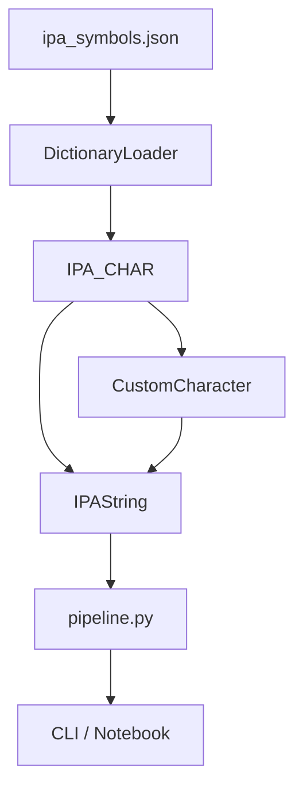
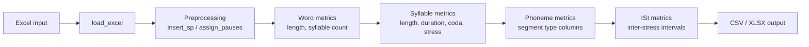

# IPA Parser


UTF-8 Unicode IPA parser and analysis toolkit.

Created for PRAAT TextGrid rhythm typology research at the SPArK lab.
Parses IPA strings phonetically (not character-wise) using a comprehensive
JSON dictionary of official IPA symbols defined in `src/ipa/data/ipa_symbols.json`.

## Table of Contents

- [Prerequisites](#prerequisites)
- [Installation](#installation)
- [CLI Usage](#cli-usage)
- [Features](#features)
- [Architecture](#architecture)
- [Library Usage](#library-usage)
- [Language Configuration (TOML)](#language-configuration-toml)
- [Data Source: ipa_symbols.json](#data-source-ipa_symbolsjson)
- [Development](#development)
- [License](#license)

## Prerequisites

- Python >= 3.11
- [pandas](https://pandas.pydata.org/) >= 2.2.0
- [openpyxl](https://openpyxl.readthedocs.io/) >= 3.1.2

Runtime dependencies are declared in `pyproject.toml` and installed automatically
when you install the package.

## Installation

```bash
python -m venv .venv
.venv/bin/python -m pip install -e .
```

For development (includes pytest, ruff, mypy):

```bash
.venv/bin/python -m pip install -e ".[dev]"
```

## CLI Usage

Interactive mode (default):
```bash
ipa-parser data/unprocessed/NorthwestSahaptin.xlsx \
  --config data/language_settings/Northwest_Sahaptin.toml
```

Batch mode (skip menu, run pipeline directly):
```bash
ipa-parser data/unprocessed/NorthwestSahaptin.xlsx \
  --config data/language_settings/Northwest_Sahaptin.toml --run
# -> data/processed/2026-02-23_NorthwestSahaptin_auto.csv
# -> data/processed/2026-02-23_NorthwestSahaptin_auto.xlsx
```

Output files are auto-named from the input filename with a `YYYY-MM-DD` prefix
and `_auto` suffix, written to `data/processed/` by default.

Additional CLI flags:

| Flag | Default | Description |
|---|---|---|
| `--config PATH` | (none) | Path to TOML language config |
| `--geminate` / `--no-geminate` | from config | Override geminate collapsing |
| `--run` | off | Skip interactive menu, run pipeline directly |
| `--format FORMAT` | `both` | Output format: `csv`, `xlsx`, or `both` |
| `--output-csv PATH` | auto-generated | Override CSV output path |
| `--output-xlsx PATH` | auto-generated | Override XLSX output path |

The interactive CLI lets you:
1. Browse the word list with syllable counts, lengths, and stress
2. Inspect individual words (segments, types, coda, stress)
3. View unique graphemes, non-phoneme marks, and unrecognized symbols
4. Add custom characters (saved to TOML config)
5. Run the full pipeline and export CSV/XLSX

## Features

- Parse IPA strings into individual phonemes via maximal munch segmentation
- Identify and categorize consonants, vowels, diacritics, suprasegmentals, tones
- Compute phonological length (weight-based: consonants/vowels = 1, diacritics = 0)
- Analyze syllable structure, stress patterns, and coda complexity
- Calculate word/syllable/sentence durations and inter-stress intervals (ISI)
- Support language-specific rules via TOML configs and `CustomCharacter`

## Architecture

The library is organized as four stacked layers, each building on the one below.



### Layer descriptions

| Layer | Module | Responsibility |
|---|---|---|
| Data | `dict_loader.py` | Loads `ipa_symbols.json`; normalizes entries into a hex-code-keyed lookup map |
| Character | `ipa_char.py` | Exposes `IPA_CHAR` class methods: `category`, `name`, `code`, `rank`, `is_valid_char` |
| Custom | `ipa_char.py` | `CustomCharacter` stores multi-character sequences (affricates, diphthongs, pauses) with category and rank |
| String | `ipa_string.py` | `IPAString` tokenizes with maximal munch, validates segments, computes length, stress, syllables, and coda |
| Pipeline | `pipeline.py` | Orchestrates Excel ingestion through per-phoneme metrics to ISI computation and CSV/XLSX export |

### Pipeline data flow



Segmentation is codepoint-based (no grapheme clustering). The pipeline entry
point is `build_final_dataframe` in `src/ipa/pipeline.py`.

## Library Usage

```python
from ipa import IPAString, IPA_CHAR, CustomCharacter

word = "bə.ˈnæ.nə"
result = IPAString(word)
```

### Phonological Length
```python
print(len(word))                # 9  (raw Unicode characters)
print(result.total_length())    # 6  (phonologically weighted)
```

### Segments and Types
```python
print(result.segments)
# ['b', 'ə', '.', 'ˈ', 'n', 'æ', '.', 'n', 'ə']

print(result.segment_type)
# ['CONSONANT', 'VOWEL', 'SUPRASEGMENTAL', 'SUPRASEGMENTAL', 'CONSONANT', 'VOWEL', 'SUPRASEGMENTAL', 'CONSONANT', 'VOWEL']

print(result.segment_count)
# {'V': 3, 'C': 3}
```

### Stress
```python
print(result.stress())    # "STRESSED"
```

### Syllables
```python
print(result.syllables)   # ['bə', 'ˈnæ', 'nə']
```

### IPA_CHAR lookups
```python
from ipa import IPA_CHAR

IPA_CHAR.category("p")   # "CONSONANT"
IPA_CHAR.rank("p")       # 1
IPA_CHAR.rank("ˈ")       # 0
IPA_CHAR.name("p")       # "VOICELESS BILABIAL PLOSIVE"
IPA_CHAR.is_valid_char("@")  # False
```

### ValidationError
```python
from ipa import ValidationError

try:
    IPAString("@@@")
except ValidationError as exc:
    print(exc)
```

## Language Configuration (TOML)

Language-specific behaviour is controlled by a TOML file placed in
`data/language_settings/`. Pass the file to the CLI with `--config`, or load it
in Python via `load_language_config`. `load_language_config` returns a
`(geminate: bool, custom_chars: list[tuple[str, str, int]])` tuple where each
entry is `(sequence, category, rank)`.

See [`data/language_settings/README.md`](data/language_settings/README.md) for
the full config format reference, valid category values, and rank semantics.

## Data Source: ipa_symbols.json

All IPA symbol definitions live in `src/ipa/data/ipa_symbols.json`. This file is the
single source of truth for the library. It organizes symbols under six top-level
category keys:

| JSON key | Internal category | Weight |
|---|---|---|
| `consonants` | `CONSONANT` | 1 |
| `vowels` | `VOWEL` | 1 |
| `diacritics` | `DIACRITIC` | 0 |
| `suprasegmentals` | `SUPRASEGMENTAL` | 0 |
| `tones` | `TONE` | 0 |
| `accent_marks` | `ACCENT_MARK` | 0 |

Each symbol entry contains `symbol`, `name`, and `alternates` fields.
`DictionaryLoader` normalizes the file at import time into an in-memory map
keyed by concatenated Unicode hex codes, which `IPA_CHAR` queries for every
lookup. Do not introduce separate lookup tables; keep the JSON as the sole data
source.

## Development

```bash
.venv/bin/python -m pip install -e ".[dev]"
pytest
ruff check src tests scripts
mypy src tests
```

See [CONTRIBUTING.md](CONTRIBUTING.md) for the full contribution guide, including
how to add new IPA symbols, create language configs, and follow code style conventions.

## License

MIT License

Copyright (c) 2026 SPArK Lab

Permission is hereby granted, free of charge, to any person obtaining a copy
of this software and associated documentation files (the "Software"), to deal
in the Software without restriction, including without limitation the rights
to use, copy, modify, merge, publish, distribute, sublicense, and/or sell
copies of the Software, and to permit persons to whom the Software is
furnished to do so, subject to the following conditions:

The above copyright notice and this permission notice shall be included in all
copies or substantial portions of the Software.

THE SOFTWARE IS PROVIDED "AS IS", WITHOUT WARRANTY OF ANY KIND, EXPRESS OR
IMPLIED, INCLUDING BUT NOT LIMITED TO THE WARRANTIES OF MERCHANTABILITY,
FITNESS FOR A PARTICULAR PURPOSE AND NONINFRINGEMENT. IN NO EVENT SHALL THE
AUTHORS OR COPYRIGHT HOLDERS BE LIABLE FOR ANY CLAIM, DAMAGES OR OTHER
LIABILITY, WHETHER IN AN ACTION OF CONTRACT, TORT OR OTHERWISE, ARISING FROM,
OUT OF OR IN CONNECTION WITH THE SOFTWARE OR THE USE OR OTHER DEALINGS IN THE
SOFTWARE.
